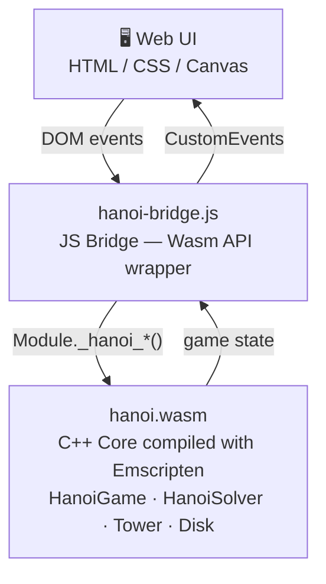
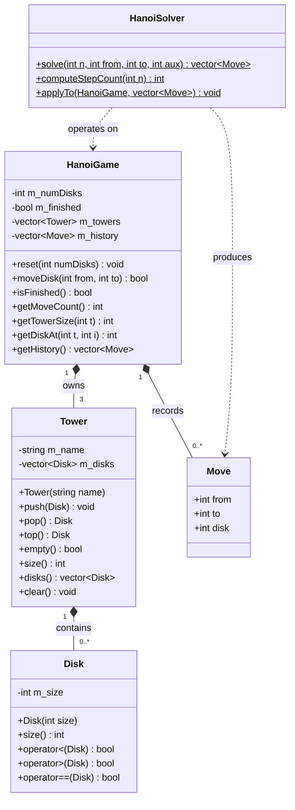
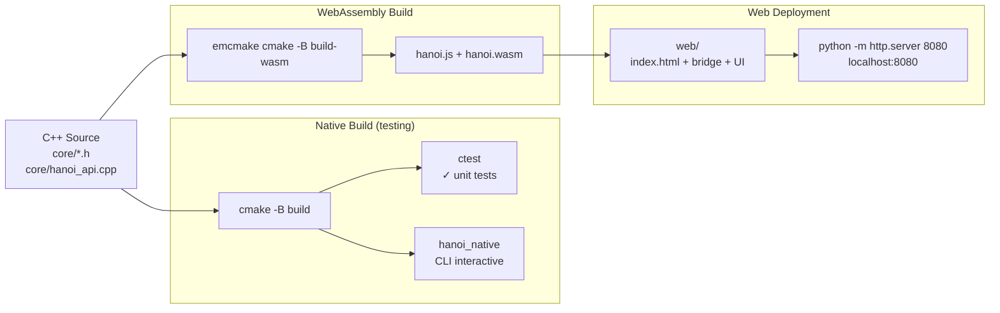

# Tower of Hanoi — C++ Core + WebAssembly

> **Design of a Reusable C++ Core for the Tower of Hanoi with WebAssembly Deployment and Browser-Based Visualization**

[](LICENSE)
[]()
[]()

---

## Architecture



**Single C++ source of truth.** No logic is duplicated in JavaScript.
The UI only renders and dispatches actions — it never makes game decisions.

---

## Repository Structure

```
Hanoi-Towers/
├── core/
│   ├── Disk.h            # Disk class (size, comparators)
│   ├── Tower.h           # Tower class — disk stack with invariant enforcement
│   ├── HanoiGame.h       # Game engine — state, moves, history
│   ├── HanoiSolver.h     # Recursive solver — generates optimal move sequence
│   └── hanoi_api.cpp     # C API exported to WebAssembly (EMSCRIPTEN_KEEPALIVE)
├── web/
│   ├── index.html        # Main UI page
│   ├── style.css         # Apple-inspired design system
│   ├── hanoi-bridge.js   # JS ↔ Wasm bridge (event-driven)
│   └── hanoi-ui.js       # Canvas renderer + controls + animations
├── tests/
│   ├── test_core.cpp     # Unit tests for the engine (no external dependencies)
│   └── test_native.cpp   # Interactive CLI for native testing
├── docs/                 # UML diagrams, screenshots
├── paper/                # Academic paper and assets
├── CMakeLists.txt        # Dual-mode build: native (tests) + Emscripten (Wasm)
└── README.md
```

---

## Class Diagram



---

## Build Flow



---

## Build Instructions

### Prerequisites

| Tool | Recommended version |
|------|---------------------|
| C++ compiler | GCC ≥ 11 / Clang ≥ 14 / MSVC 2022 |
| CMake | ≥ 3.20 |
| Emscripten SDK | latest |

### 1. Install Emscripten

```bash
git clone https://github.com/emscripten-core/emsdk.git
cd emsdk
./emsdk install latest
./emsdk activate latest

# Linux / macOS:
source ./emsdk_env.sh

# Windows (PowerShell):
.\emsdk_env.ps1
```

### 2. Native build (test without a browser)

```bash
cmake -B build -DCMAKE_BUILD_TYPE=Debug
cmake --build build

# Run unit tests
ctest --test-dir build --output-on-failure

# Interactive CLI
./build/hanoi_native        # Linux/macOS
.\build\Debug\hanoi_native.exe   # Windows
```

### 3. WebAssembly build

```bash
emcmake cmake -B build-wasm
cmake --build build-wasm

# Copy output to web/
cp build-wasm/hanoi.js   web/
cp build-wasm/hanoi.wasm web/
```

### 4. Serve the UI

```bash
# Python
cd web && python -m http.server 8080

# Node.js
cd web && npx serve .
```

Then open `http://localhost:8080`.

---

## Wasm API (C → JS)

| Function | Description |
|----------|-------------|
| `hanoi_init(n)` | Initialize with n disks |
| `hanoi_reset(n)` | Restart the game |
| `hanoi_move(from, to)` | Move a disk; returns 1 if legal |
| `hanoi_is_finished()` | Returns 1 if the puzzle is solved |
| `hanoi_get_move_count()` | Total moves made |
| `hanoi_get_num_disks()` | Number of disks |
| `hanoi_get_tower_size(t)` | Disks on tower t |
| `hanoi_get_disk_at(t, i)` | Size of disk at position i on tower t |
| `hanoi_solve_precompute()` | Compute optimal solution; returns step count |
| `hanoi_solve_step_from(i)` | Source tower of step i |
| `hanoi_solve_step_to(i)` | Destination tower of step i |
| `hanoi_solve_step_disk(i)` | Disk moved at step i |

---

## UI Features

- **Manual mode** — click or use keys `1` `2` `3` to select and move disks
- **Auto-solve mode** — recursive solver with step-by-step animation
- **Speed control** — animation speed from 1× to 10×
- **Move history** — live log of every move
- **Statistics** — move count, optimal, efficiency (0–100%)
- **Undo** — revert last move in manual mode
- **Responsive** — works on mobile and desktop
- **JS fallback** — UI works without Wasm for development

---

## Academic Axes

1. **OOP modeling** — `Disk`, `Tower`, `HanoiGame`, `HanoiSolver`
2. **Stack as data structure** — `Tower` implements a LIFO stack with invariant enforcement
3. **Recursive solver** — classic Hanoi algorithm, O(2ⁿ − 1) steps
4. **Core / UI separation** — game logic never lives in JavaScript
5. **WebAssembly compilation** — Emscripten + CMake dual-mode build
6. **C++/JS integration** — C functions exported via `EMSCRIPTEN_KEEPALIVE`
7. **Interactive visualization** — Canvas + event-driven JS bridge

---

## License

MIT — see [LICENSE](LICENSE)
