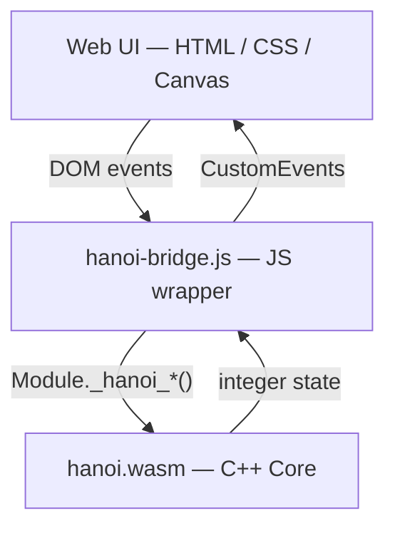

# Tower of Hanoi — C++ Core + WebAssembly

> A reusable C++ engine for the Tower of Hanoi puzzle compiled to WebAssembly and deployed as an interactive browser-based visualization.

[](LICENSE)
[]()
[]()
[](https://deepdevjose.github.io/Hanoi-Towers/)

---

## Overview

This project demonstrates how a **single C++ core** implementing the Tower of Hanoi domain — including game state, constraint enforcement, recursive solver, and move history — can be compiled to **WebAssembly** via Emscripten and consumed by a thin JavaScript bridge layer, keeping all presentation logic strictly separated in the browser UI.

The result is a reproducible software artifact that illustrates:
- object-oriented design with formal invariant enforcement,
- stack-based data structures as first-class domain primitives,
- recursive algorithm analysis (time complexity O(2ⁿ)),
- cross-compilation of C++17 to a portable binary format (Wasm),
- and clean separation of concerns across system layers.

---

## Live Demo

🌐 **[deepdevjose.github.io/Hanoi-Towers](https://deepdevjose.github.io/Hanoi-Towers/)**

---

## Architecture Overview



See [`docs/architecture.md`](docs/architecture.md) for a full description of each layer.

---

## Key Features

| Feature | Description |
|---------|-------------|
| Single C++ core | All game logic lives in C++; zero duplication in JS |
| WebAssembly runtime | Core compiled with Emscripten to `.wasm` |
| Optimal solver | Recursive algorithm producing exactly 2ⁿ − 1 moves |
| Manual play | Click or keyboard (1/2/3) to move disks interactively |
| Animated auto-solve | Step-by-step Bezier arc animation with speed control |
| Move history & undo | Full history tracking; undo via state replay |
| JS fallback | UI runs without Wasm for development and CI previews |

---

## Technology Stack

| Layer | Technology |
|-------|------------|
| Game engine | C++17 (header-only core) |
| Compilation target | WebAssembly via Emscripten |
| JS integration | Exported C functions (`EMSCRIPTEN_KEEPALIVE`) |
| Build system | CMake 3.20+ (dual-mode: native + Wasm) |
| Frontend | Vanilla HTML5 / CSS3 / Canvas API |
| Deployment | GitHub Actions → GitHub Pages |

---

## How to Run

### Prerequisites

```
C++ compiler  (GCC ≥ 11 / Clang ≥ 14 / MSVC 2022)
CMake         ≥ 3.20
Emscripten    latest  (via emsdk)
Python        3.x     (for local server)
```

### Local (native tests)

```bash
cmake -B build -DCMAKE_BUILD_TYPE=Debug
cmake --build build
ctest --test-dir build --output-on-failure
```

### WebAssembly build

```bash
source /path/to/emsdk/emsdk_env.sh          # Linux/macOS
# .\emsdk_env.ps1                           # Windows PowerShell

emcmake cmake -B build-wasm
cmake --build build-wasm
cp build-wasm/hanoi.js build-wasm/hanoi.wasm web/
```

### Serve

```bash
cd web && python -m http.server 8080
# open http://localhost:8080
```

---

## Repository Structure

```
Hanoi-Towers/
├── core/                  # C++ engine (header-only + API)
│   ├── Disk.h
│   ├── Tower.h
│   ├── HanoiGame.h
│   ├── HanoiSolver.h
│   └── hanoi_api.cpp      # Wasm-exported C API
├── web/                   # Browser frontend
│   ├── index.html
│   ├── style.css
│   ├── hanoi-bridge.js    # JS ↔ Wasm bridge
│   └── hanoi-ui.js        # Canvas renderer + interaction
├── tests/
│   ├── test_core.cpp      # Unit tests (no external deps)
│   └── test_native.cpp    # Interactive CLI
├── docs/                  # Academic documentation
│   ├── architecture.md
│   ├── design.md
│   ├── algorithm.md
│   ├── wasm.md
│   ├── frontend.md
│   ├── experiments.md
│   └── conclusion.md
├── paper/                 # Academic paper assets
├── CMakeLists.txt
└── README.md
```

---

## Documentation

| Document | Description |
|----------|-------------|
| [Architecture](docs/architecture.md) | System layers, data flow, separation of concerns |
| [Design](docs/design.md) | OOP design, class invariants, stack rationale |
| [Algorithm](docs/algorithm.md) | Recurrence relation, complexity analysis, correctness proof |
| [WebAssembly](docs/wasm.md) | Emscripten toolchain, C/JS integration model |
| [Frontend](docs/frontend.md) | Canvas renderer, event-driven bridge, state management |
| [Experiments](docs/experiments.md) | Empirical validation of O(2ⁿ) growth |
| [Conclusion](docs/conclusion.md) | Outcomes, limitations, future work |

---

## Authors

**José** — [github.com/deepdevjose](https://github.com/deepdevjose)

---

## License

MIT — see [LICENSE](LICENSE)
