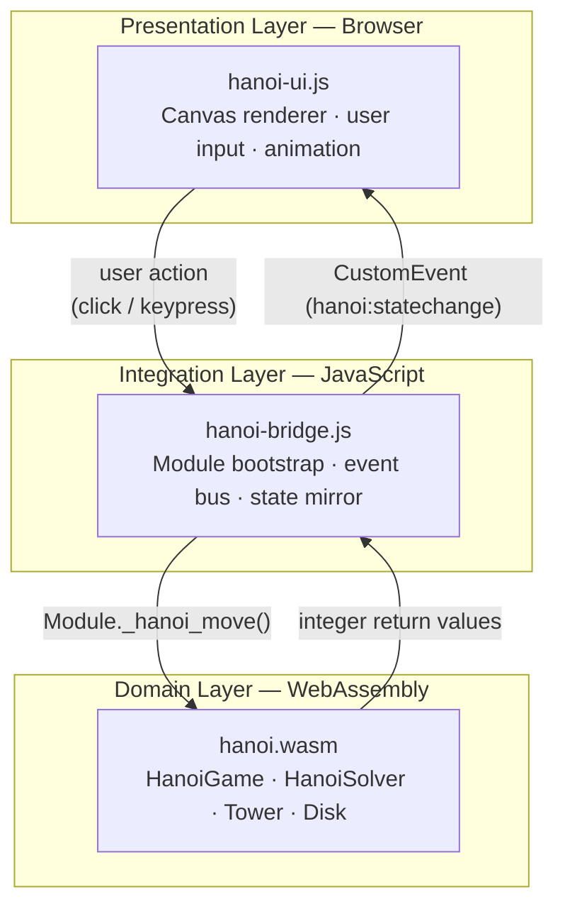
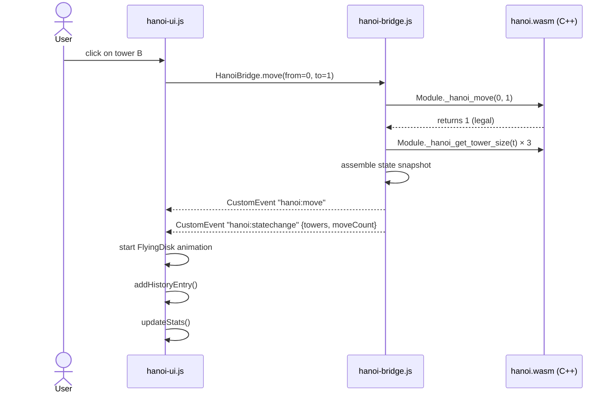
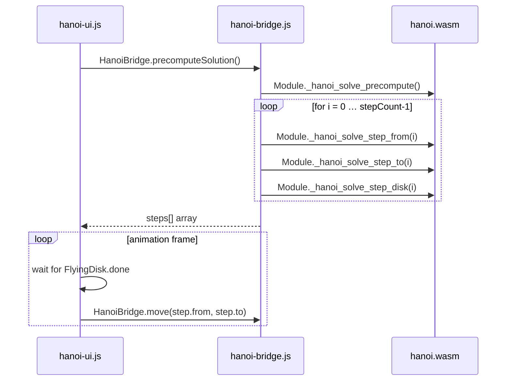

3# System Architecture

## 1. Overview

The system is structured as a **three-layer vertical slice**: a compiled C++ core, a thin JavaScript bridge, and a browser-native presentation layer. This decomposition enforces a strict unidirectional information flow and eliminates any coupling between domain logic and rendering concerns.

The central design invariant is:

> **All game logic resides exclusively in the C++ core. JavaScript is used solely for I/O mediation.**

This constraint makes the core independently testable (via native compilation), portable (reusable in non-browser contexts), and auditable in isolation from UI concerns.

---

## 2. Layer Decomposition

### 2.1 Domain Layer — C++ Core (`hanoi.wasm`)

The core is a self-contained C++17 library compiled to WebAssembly. It owns:

- **State**: disk configuration across three pegs, represented as three `std::vector<Disk>` stacks.
- **Constraint enforcement**: the fundamental Hanoi invariant (no larger disk on a smaller one) is checked at every move attempt and rejected atomically.
- **Solver**: the recursive algorithm that generates the optimal move sequence of length 2ⁿ − 1.
- **History**: an append-only log of `Move` records (`{from, to, disk}`).

The core exposes no internal types to the outside world. Its public interface is a flat set of C functions decorated with `EMSCRIPTEN_KEEPALIVE`.

### 2.2 Integration Layer — JS Bridge (`hanoi-bridge.js`)

The bridge is intentionally minimal. Its responsibilities are:

1. **Bootstrap**: dynamically load the Emscripten-generated `hanoi.js` module and wait for `HanoiModule()` to resolve.
2. **Type translation**: convert JavaScript integers to C `int` parameters and back.
3. **Event emission**: on every state-changing call, query the core for the new state and dispatch a `CustomEvent` on `document`, decoupling the bridge from any specific UI implementation.
4. **Facade**: expose a clean `HanoiBridge` object so no UI code ever calls `Module._xxx` directly.

### 2.3 Presentation Layer — UI (`hanoi-ui.js` + `index.html` + `style.css`)

The presentation layer is a pure rendering and input-handling module. It:

- subscribes to `CustomEvent` types (`hanoi:statechange`, `hanoi:move`, `hanoi:finished`, `hanoi:reset`) emitted by the bridge,
- maintains a *visual state* (`visualTowers`) that lags behind the real game state during animations,
- drives a 60 fps Canvas render loop using `requestAnimationFrame`,
- and dispatches user actions (clicks, keyboard input) upward through the bridge.

The UI holds **zero game logic**. It cannot determine whether a move is legal; it delegates that entirely to the core.

---

## 3. Data Flow

### 3.1 User-initiated move

### 3.2 Auto-solve playback

---

## 4. Separation of Concerns

| Concern | Owner | Rationale |
|---------|-------|-----------|
| Move legality | C++ core | Single enforcement point; cannot be bypassed |
| Game state | C++ core | Authoritative; UI holds only a visual mirror |
| Optimal solution | C++ core (HanoiSolver) | Deterministic; isolated from rendering |
| History log | C++ core | Append-only; not subject to UI decisions |
| Animation | UI (hanoi-ui.js) | Pure presentation; does not affect game state |
| Event routing | JS Bridge | Decouples emitter from subscriber |
| Layout/style | CSS | Zero JS coupling |

---

## 5. Compilation Targets

The CMakeLists.txt is structured to produce two distinct binaries from the same source:

| Target | Toolchain | Output | Purpose |
|--------|-----------|--------|---------|
| `hanoi_tests` | Native C++ | `hanoi_tests` executable | Unit testing without browser |
| `hanoi_native` | Native C++ | `hanoi_native` executable | Interactive CLI validation |
| `hanoi` | Emscripten | `hanoi.js` + `hanoi.wasm` | Browser deployment |

This dual-mode build is the standard pattern for WebAssembly projects that require offline testability. The core headers are shared across all targets without modification.
