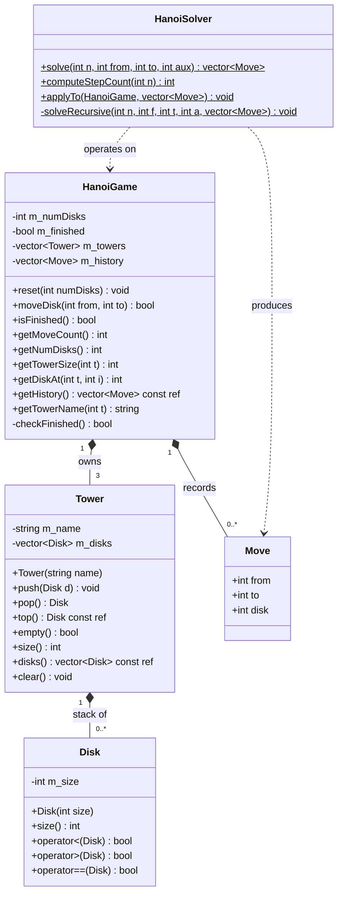
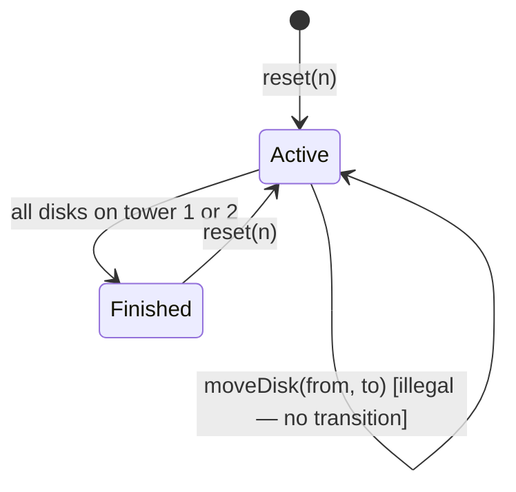

# Object-Oriented Design

## 1. Design Philosophy

The domain model follows a strict **single-responsibility principle**: each class encapsulates exactly one conceptual entity of the Tower of Hanoi problem domain. Classes are designed as value-semantic types where possible, with invariants enforced at construction and mutation boundaries.

The central principle is **invariant ownership**: the class that owns a data structure is also the only class authorized to validate mutations to it.

---

## 2. Class Overview



---

## 3. Class Specifications

### 3.1 `Disk`

**Responsibility**: Represent a single disk as an immutable integer size.

A `Disk` is a simple value type wrapping a non-negative integer. Its interface exposes only comparison operators, which are used by `Tower` to enforce placement rules. The size is set at construction and never mutated.

**Invariant**: `size ≥ 1`.

```cpp
class Disk {
    int m_size;
public:
    explicit Disk(int size);
    int size() const;
    bool operator<(const Disk&) const;
    bool operator>(const Disk&) const;
    bool operator==(const Disk&) const;
};
```

**Design note**: `Disk` is kept minimal and value-semantic (copyable, comparable) so that it can be stored by value in `std::vector`, enabling stack operations with no heap allocation per disk.

---

### 3.2 `Tower`

**Responsibility**: Enforce the ordering invariant for a single peg.

`Tower` wraps a `std::vector<Disk>` as a **LIFO stack** and enforces the fundamental Hanoi rule at every `push` call: a disk may only be placed on an empty tower or on top of a strictly larger disk.

**Invariant (maintained at all times)**:
> For all i < j in `m_disks`, `m_disks[i].size() > m_disks[j].size()`.
> That is, larger disks are at lower indices (bottom); the top is always the smallest resident disk.

```cpp
void Tower::push(const Disk& disk) {
    if (!m_disks.empty() && m_disks.back().size() < disk.size())
        throw std::invalid_argument("Hanoi invariant violation");
    m_disks.push_back(disk);
}
```

**Why a stack?**

The Tower of Hanoi is fundamentally a stack problem. The access pattern is strictly LIFO: only the top disk of each peg is ever accessible. No random access to intermediate disks is legal or meaningful. Using `std::vector<Disk>` with push/pop at the back models this constraint directly in the type system — illegal access patterns cannot be expressed at all.

Alternatives such as `std::list` or raw arrays were rejected: `std::vector` provides O(1) amortized push/pop, O(1) indexed read (used for state serialization to JS), and contiguous memory layout compatible with Wasm's linear memory model.

---

### 3.3 `Move`

**Responsibility**: Record a single state transition.

`Move` is a plain aggregate type capturing the source tower, destination tower, and disk size of a single move. It serves dual purposes: populating the history log and representing a step in the precomputed solver output.

```cpp
struct Move {
    int from;  // source tower index ∈ {0, 1, 2}
    int to;    // destination tower index ∈ {0, 1, 2}
    int disk;  // size of moved disk
};
```

---

### 3.4 `HanoiGame`

**Responsibility**: Implement the complete game state machine.

`HanoiGame` is the central domain class. It owns three `Tower` instances and an append-only `Move` history. It exposes a controlled mutation interface: only `moveDisk` and `reset` modify state, and both validate preconditions exhaustively before applying any change.

**State transitions**:



**Win condition**: The puzzle is solved when tower 0 is empty and either tower 1 or tower 2 holds all `n` disks. This is evaluated after every successful move via `checkFinished()`.

**History integrity**: The history vector is append-only and is cleared only on `reset`. It therefore constitutes a complete, auditable record of all moves in the current session.

---

### 3.5 `HanoiSolver`

**Responsibility**: Generate the optimal move sequence without side effects.

`HanoiSolver` is a **stateless utility class** containing only static methods. It implements the classical three-peg recursive algorithm and returns a `std::vector<Move>` representing the complete optimal solution.

The solver operates on parameters alone (disk count, peg indices) and does not modify any `HanoiGame` instance. The `applyTo` helper is provided for convenience in test scenarios.

```cpp
static std::vector<Move> solve(int n, int from=0, int to=2, int aux=1);
```

See [`docs/algorithm.md`](algorithm.md) for the full derivation and complexity analysis.

---

## 4. Invariant Summary

| Invariant | Enforced by | Violation response |
|-----------|-------------|-------------------|
| Disk size ≥ 1 | `Disk` constructor | — (caller responsibility) |
| No larger disk on smaller | `Tower::push` | `std::invalid_argument` |
| From ≠ To in moveDisk | `HanoiGame::moveDisk` | returns `false` |
| Source tower non-empty | `HanoiGame::moveDisk` | returns `false` |
| numDisks ∈ [1, 20] | `HanoiGame::reset` | `std::invalid_argument` |
| Tower index ∈ {0,1,2} | All query methods | returns `-1` sentinel |

---

## 5. Header-Only Core

All core classes (`Disk`, `Tower`, `HanoiGame`, `HanoiSolver`) are implemented as header-only C++17. This design choice was deliberate:

1. **Single compilation unit for Wasm**: `hanoi_api.cpp` includes all headers directly, producing a single translation unit that Emscripten compiles to one `.wasm` binary.
2. **No link-time complexity**: native tests include the same headers with no additional build configuration.
3. **Template compatibility**: header-only allows future parameterization over disk type or peg count without ABI concerns.
