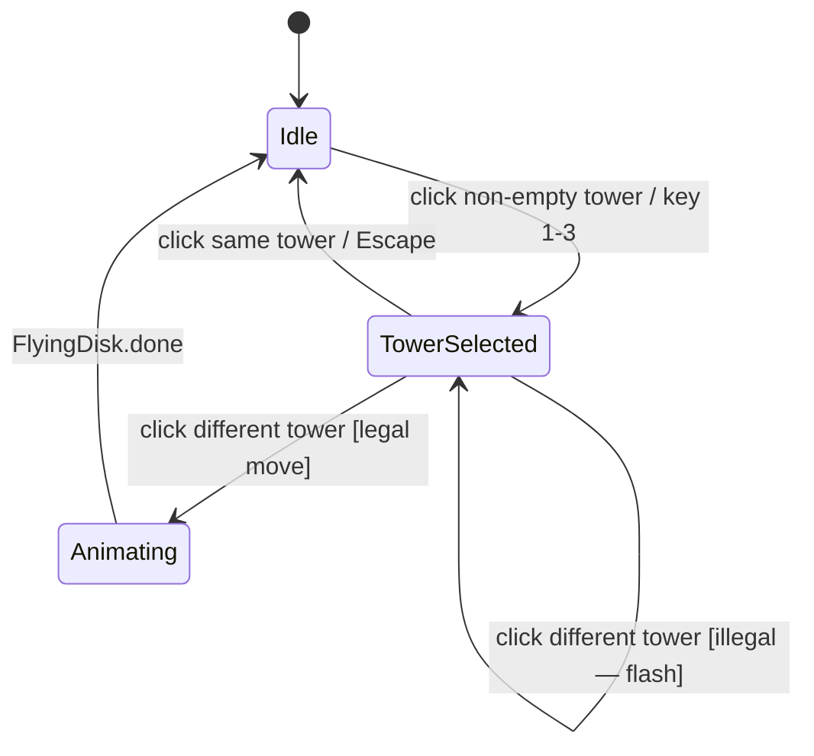

# Frontend Architecture

## 1. Overview

The frontend is a single-page application composed of three files — `index.html`, `style.css`, and `hanoi-ui.js` — that collectively implement the presentation layer of the system. No JavaScript framework is used; the rendering pipeline is built directly on the **HTML5 Canvas API** and the browser's native event system.

The frontend satisfies a strict constraint inherited from the overall system architecture:

> **The UI holds zero game logic.** It cannot determine whether a move is legal, compute an optimal solution, or check the win condition. All such queries are delegated exclusively to the C++ core via the JS bridge.

---

## 2. Rendering Pipeline

All game state is rendered to a `<canvas>` element through a **continuous render loop** driven by `requestAnimationFrame`:

```
requestAnimationFrame(renderLoop)
       │
       ▼
renderLoop(now: DOMHighResTimeStamp)
  ├── update FlyingDisk animation position
  ├── check auto-solve queue (dispatch next step if animation done)
  ├── decay tower flash alpha
  └── draw()
       ├── drawBackground()
       ├── drawBase()
       ├── for each tower: drawTower()
       │     ├── drawHoverHighlight()
       │     ├── drawFlashOverlay()
       │     ├── drawPole()
       │     └── for each disk: drawDisk()
       ├── drawFlyingDisk()    (if animation in progress)
       └── drawSelectionRing() (if tower selected)
```

The loop runs unconditionally at 60 fps. This is a standard game-loop pattern; the canvas content is redrawn from scratch every frame based on the current state of the visual model. No dirty-region tracking or incremental updates are performed.

### 2.1 Layout Geometry

All drawing coordinates are computed dynamically from the canvas dimensions on every frame via `getLayout(w, h, n)`:

```js
function getLayout(w, h, n) {
    const groundY  = h - 64;
    const diskH    = Math.min(38, Math.max(18, (groundY - 100) / (n + 2)));
    const poleH    = diskH * n + 36;
    const maxDiskW = (w / 3) * 0.80;
    const minDiskW = Math.max(26, diskH);
    const cx       = [w/6, w/2, w*5/6];
    return { groundY, diskH, poleH, maxDiskW, minDiskW, cx, n };
}
```

This approach ensures that the visualization scales correctly to any canvas size without hard-coded pixel values. The three tower centers (`cx`) divide the canvas into equal thirds, and disk dimensions are derived from `n` so that all disks remain visible regardless of disk count.

---

## 3. Animation System

### 3.1 Visual State vs. Game State

The UI maintains two representations of disk positions:

| Representation | Description |
|---------------|-------------|
| `gameState` | The authoritative state returned by `HanoiBridge.getState()`. Updated immediately on every move. |
| `visualTowers` | The *visual* state used for rendering. Lags behind `gameState` during animations. |

When a move is applied, the disk is removed from `visualTowers[from]` immediately (so it is no longer drawn on the source peg), and a `FlyingDisk` animation object is created. The disk is added to `visualTowers[to]` only when the animation completes.

This split prevents the visual "teleportation" that would occur if the canvas rendered the game state directly on the frame immediately following a move.

### 3.2 `FlyingDisk` — Quadratic Bézier Arc

Each disk move is animated as a **quadratic Bézier curve**:

```
P(t) = (1-t)² · P0 + 2(1-t)t · Pc + t² · P1
```

where:
- **P0** = center of the top disk on the source peg (at move time),
- **P1** = center of the landing position on the destination peg,
- **Pc** = control point, placed above both endpoints:
  `Pc.x = (P0.x + P1.x) / 2`, `Pc.y = min(P0.y, P1.y) − max(60, |P1.x − P0.x| × 0.35)`.

The control point height scales with horizontal distance, producing a natural arc that rises higher for cross-tower moves than for adjacent-tower moves.

The parameter t is driven by an **ease-in-out cubic** timing function:

```
t' = t < 0.5 ? 4t³ : 1 − (−2t + 2)³ / 2
```

This provides acceleration at the start and deceleration at the end, giving the motion a physically plausible feel that matches the Apple HIG guidelines for spring-based animations.

### 3.3 Animation Duration

| Mode | Duration |
|------|---------|
| Manual (user move) | 320 ms (fixed) |
| Auto-solve | `1100 − speed × 90` ms, range 200–1010 ms |

The auto-solve delay between consecutive steps is `max(0, 500 − speed × 48)` ms, clamped to zero at maximum speed for continuous playback.

---

## 4. Interaction Model

### 4.1 Manual Mode

User input follows a **two-click selection model**:

1. First click on a tower → selects it (shown with a blue ring and an elevated top disk).
2. Second click on a different tower → dispatches `HanoiBridge.move(from, to)`.
   - If the move is legal: the animation starts.
   - If the move is illegal: the destination tower flashes red for 600 ms.

Keyboard shortcuts `1`, `2`, `3` map directly to tower indices. Pressing the same key twice cancels the selection. `Escape` unconditionally cancels.



### 4.2 Auto-Solve Mode

The precomputed solution (an array of `{from, to, disk}` steps) is loaded into a queue. The render loop dispatches one step per iteration when:
- No disk is currently animating (`flyingDisk === null`), and
- The time elapsed since the last move completes (`now − lastMoveEndAt ≥ solveDelay()`).

This timer-free, render-loop-driven dispatch avoids `setTimeout` drift and ensures each move is rendered for at least one full frame before the next begins.

---

## 5. State Management

The UI manages the following mutable state:

| Variable | Type | Description |
|----------|------|-------------|
| `gameState` | object | Mirror of bridge state snapshot |
| `visualTowers` | `int[][]` | Visual peg contents (excludes flying disk) |
| `flyingDisk` | `FlyingDisk \| null` | Active animation, or null |
| `selectedTower` | `int` | Index of selected peg (−1 = none) |
| `hoveredTower` | `int` | Index of hovered peg (−1 = none) |
| `mode` | `'manual' \| 'auto'` | Current interaction mode |
| `solving` | `bool` | Whether auto-solve is in progress |
| `solveQueue` | `Move[]` | Remaining steps in auto-solve |
| `undoStack` | `Move[]` | History for undo (manual mode) |
| `towerFlash` | `{tower, type, alpha, start} \| null` | Active flash effect |

All state mutations are localized to event handlers and the render loop. No global mutation occurs outside these controlled entry points.

---

## 6. Undo Implementation

The C++ core has no native undo operation. Undo is implemented in the UI layer via **full history replay**:

1. Pop the last entry from `undoStack`.
2. Call `HanoiBridge.reset(n)` — this returns the game to the initial state.
3. Re-apply all remaining entries in `undoStack` via `HanoiBridge.move`.
4. Sync `visualTowers` from the resulting `HanoiBridge.getState()`.

This approach is O(k) per undo, where k is the current move count. For the problem sizes considered (n ≤ 10, k ≤ 2ⁿ − 1 = 1023), this is imperceptible. A more efficient implementation would expose a native undo API in the C++ core, recording moves in a stack and reversing them in O(1) amortized time.

---

## 7. Responsive Layout

The layout uses a CSS Grid with two columns: the canvas section (flexible width) and the sidebar (fixed 300 px). Below 860 px viewport width, the grid collapses to a single column with the canvas above the sidebar. The canvas height is computed as `calc(100vh − 240px)`, ensuring it fills the visible area on any display.

The Canvas API's `devicePixelRatio` scaling is applied at resize time to produce sharp rendering on high-DPI displays (Retina, HiDPI):

```js
canvas.width  = cssWidth  * devicePixelRatio;
canvas.height = cssHeight * devicePixelRatio;
ctx.setTransform(devicePixelRatio, 0, 0, devicePixelRatio, 0, 0);
```
