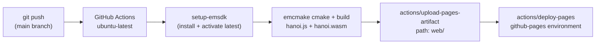

# WebAssembly Integration

## 1. What Is WebAssembly?

WebAssembly (abbreviated Wasm) is a binary instruction format defined by the W3C as an open web standard (ratified 2019). It specifies a **stack-based virtual machine** with a well-defined type system (`i32`, `i64`, `f32`, `f64`), a **linear memory model** (a contiguous byte array accessible to both Wasm and the host environment), and a structured control flow graph that excludes arbitrary `goto` and indirect jumps.

Key properties relevant to this project:

| Property | Implication |
|----------|-------------|
| Deterministic execution | Identical behavior across browsers and platforms |
| Near-native performance | Compiled to machine code by the browser JIT |
| Sandboxed memory | Linear memory is isolated from the browser heap |
| Portable binary format | One `.wasm` file runs on any compliant runtime |
| Host integration via imports/exports | Functions callable bidirectionally across the boundary |

---

## 2. Motivation for C++ → Wasm

The Tower of Hanoi engine was implemented in C++ and compiled to Wasm rather than reimplemented in JavaScript for the following reasons:

1. **Single source of truth**: The C++ core can be compiled natively for automated testing, and compiled to Wasm for browser deployment — without modifying a single line of source. Reimplementing in JS would introduce two independent implementations that must be kept in sync.

2. **Formal constraint enforcement**: C++ allows invariants to be encoded directly in the type system (`Tower::push` throws on violation). JS has no equivalent of `std::invalid_argument` at the type level.

3. **Separation of computation and presentation**: By keeping computation in a compiled artifact, the project demonstrates that the game engine is independent of the rendering technology. The same `.wasm` could be consumed by a native desktop UI, a CLI tool, or a different web framework.

4. **Academic reproducibility**: A Wasm binary is a deterministic artifact. Given the same source and the same Emscripten version, the binary is reproducible, which satisfies the reproducibility requirements of a software research artifact.

---

## 3. Toolchain: Emscripten

Emscripten is a complete LLVM-based compiler toolchain for compiling C/C++ to WebAssembly. It replaces the standard C++ toolchain:

```
Source (.cpp) → Clang/LLVM IR → Binaryen (Wasm optimizer) → .wasm binary
                                                           → .js loader (glue code)
```

The generated `.js` file (the "glue") handles:
- instantiation of the Wasm module,
- memory allocation and stack setup,
- libc emulation (file I/O, etc. — not used in this project),
- and the `Module` object that exposes Wasm exports to JavaScript.

### 3.1 Build Configuration

The CMakeLists.txt uses `emcmake` (Emscripten's CMake wrapper) to inject the Emscripten toolchain file:

```bash
emcmake cmake -B build-wasm -DCMAKE_BUILD_TYPE=Release
cmake --build build-wasm
```

Key linker flags used:

| Flag | Effect |
|------|--------|
| `-sMODULARIZE=1` | Wraps output in a factory function `HanoiModule()` |
| `-sEXPORT_NAME=HanoiModule` | Names the factory function |
| `-sEXPORTED_FUNCTIONS=[...]` | Explicit list of exported C functions |
| `-sEXPORTED_RUNTIME_METHODS=[cwrap,ccall,...]` | JS helper utilities |
| `-sALLOW_MEMORY_GROWTH=1` | Allows heap to grow dynamically |
| `-sENVIRONMENT=web` | Strips Node.js/worker code paths |
| `--no-entry` | No `main()` function required |
| `-O2` | Production optimization level |

`-sMODULARIZE=1` is essential: it prevents the Wasm module from auto-instantiating on script load, which would race with the browser's module system. Instead, the bridge calls `HanoiModule()` explicitly and awaits its `Promise`.

---

## 4. Exporting C++ Functions

The C++ functions visible to JavaScript are declared in `core/hanoi_api.cpp` with two annotations:

```cpp
extern "C" {
    EMSCRIPTEN_KEEPALIVE
    int hanoi_move(int from, int to) {
        return g_game.moveDisk(from, to) ? 1 : 0;
    }
}
```

- `extern "C"` disables C++ name mangling, so the symbol is exported as `hanoi_move` rather than a mangled identifier.
- `EMSCRIPTEN_KEEPALIVE` prevents the Emscripten dead-code eliminator from removing functions that have no direct callers in C++.

The exported API is deliberately **flat**:
- All parameters are `int` (native Wasm `i32`).
- All return values are `int`.
- No pointers, structs, or strings cross the boundary.

This design avoids the complexity of Emscripten's memory management for heap-allocated types and keeps the bridge-to-core interface auditable at a glance.

---

## 5. JS Bridge Integration

The bridge (`hanoi-bridge.js`) bootstraps the module and wraps each exported function:

```js
async function init(wasmUrl = './hanoi.js') {
    return new Promise((resolve, reject) => {
        const script = document.createElement('script');
        script.src = wasmUrl;
        script.onload = () => {
            HanoiModule().then(instance => {
                M = instance;   // M holds the instantiated module
                resolve();
            }).catch(reject);
        };
        document.head.appendChild(script);
    });
}

function move(from, to) {
    const ok = M._hanoi_move(from, to) === 1;
    if (ok) emit('hanoi:move', { from, to });
    return ok;
}
```

The `M._hanoi_move` syntax calls the exported Wasm function directly. The underscore prefix is Emscripten's convention for raw C exports.

### 5.1 State Snapshot

Because the Wasm linear memory is not directly observable as a JavaScript object, the bridge queries state through the exported accessor functions after every mutation:

```js
function getState() {
    const towers = [0, 1, 2].map(t => {
        const sz = M._hanoi_get_tower_size(t);
        const disks = [];
        for (let i = 0; i < sz; i++) disks.push(M._hanoi_get_disk_at(t, i));
        return disks;
    });
    return { numDisks: M._hanoi_get_num_disks(), moveCount: M._hanoi_get_move_count(),
             finished: M._hanoi_is_finished() === 1, towers };
}
```

This is an **eager pull** model: the bridge reads back the complete state on every relevant call. An alternative would be a **push** model where the C++ core calls JS callbacks directly (using `EM_ASM` or Embind). The pull model was chosen for simplicity and auditability: the JS state snapshot is always a faithful projection of the Wasm state at the moment of the call.

---

## 6. Memory and Type Model

The Wasm linear memory is a flat byte array shared between the C++ heap and the JS runtime (via `Module.HEAP*` typed arrays). In this project:

- No pointers or heap-allocated C++ objects are exposed to JS.
- All cross-boundary values are scalar `i32` integers.
- The C++ `std::vector` structures live in Wasm linear memory and are never directly accessed from JS.

This design fully avoids the **memory ownership** problem that arises when passing C++ pointers to JavaScript (where the GC can move or collect objects independently of the C++ heap).

---

## 7. Deployment Pipeline



The CI workflow (`.github/workflows/deploy.yml`) installs Emscripten on a fresh Ubuntu runner, builds the Wasm binary, copies the output into `web/`, and deploys the `web/` directory to GitHub Pages — ensuring that the live demo always reflects the latest committed source.
